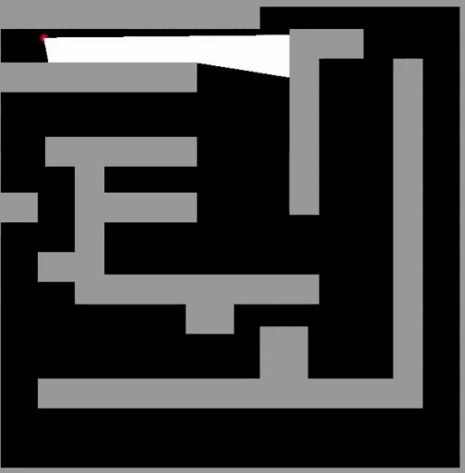

### Pseudo-3D Renderer

```
$ git clone https://github.com/Ailurus-code/Pseudo3D
```
<p>
    <image src="/img/demo1.png" width=400px></image>
    <image src="/img/demo2.png" width=400px></image>
</p>



To successfully build and run project you need to add [SFML](https://www.sfml-dev.org/index.php)
```
$ mkdir build
$ cd build
$ cmake -G Ninja ..
$ cmake --build .
```